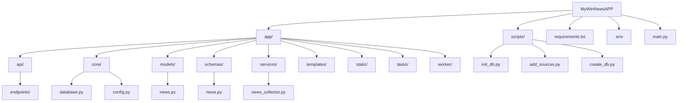
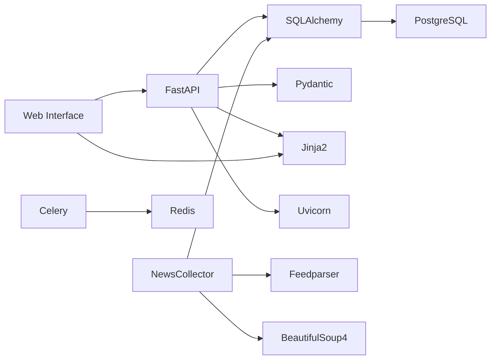

# Структура проекта MyWinNewsAPP

## Диаграмма структуры проекта

## Диаграмма зависимостей

## Основные компоненты

1. **API Layer**
   - FastAPI endpoints для REST API
   - Pydantic модели для валидации данных

2. **Data Layer**
   - SQLAlchemy модели
   - PostgreSQL база данных

3. **Service Layer**
   - NewsCollector для сбора новостей
   - Feedparser для парсинга RSS
   - BeautifulSoup4 для парсинга веб-страниц

4. **Task Processing**
   - Celery для асинхронных задач
   - Redis как брокер сообщений

5. **Web Interface**
   - Jinja2 шаблоны
   - Статические файлы

6. **Configuration**
   - .env файл для переменных окружения
   - config.py для настроек приложения

7. **Database Management**
   - Скрипты инициализации и миграции
   - Управление источниками новостей 